# Projekat webprodavnica Kolačić
Projekat Webprodavnica "Kolačić" Nebojša Tutić Python smer 2019/2020 profesor Vladimir Marić

<em>Ovo je dokumentacija za korisnike. Developer dokumentaciju pogledajte u delu "Developer dokumentacija".</em>

## Instalacija

Kako bi pokrenuli aplikaciju, potrebno je da na svom računaru imate instaliran [Python verziju 3.8.](https://www.python.org).
Nakon instalacije Python-a, potrebno je da instalirate Django (verzija 3.1), koja se instalira komandom (ukucati u terminalu ili command prompt-u) **"pip install django"**.
Posle instalacije djanga, poitrebno je da instalirate paket pillow koji se instalira komandom (isto ukucati u terminalu ili command prompt-u) **"pip install pillow"**.

Raspored svih monandi:

* `www.python.org`      - First install Python 3.8.
* `pip install django`  - Install Django version 3.1 or later.
* `pip install pillow`  - Install pillow.

## Pokretanje programa

Nakon sto ste instalirali sve pakete navedene u sekciji "Instalacija", spremni ste da pokrenete aplikaciju. Aplikaciju je prvo potrebno kopirati na racunar, recimo na Desktop. Posle toga u terminalu ili ako koristite Windows u Command Prompt-u otvorite tj. dođete do putanje gde ste prekopirali aplikaciju i udjete u folder komandom (cd eprodavnica). 

Sada ste spremni da pokrenete aplikaciju komandom **"python manage.py runserver"** i ukoliko je sve instalirano pojavice vam se poruka da je aplikacija pokrenuta na lokalnoj adresi 127.0.0.1:8000. Kliknite na taj link ili jednostavno prekopirajte tu adresu u web browser, uspešno ste otvorili našu aplikaciju!

## Početna strana

Otvara vam se home page ili početna strana koja izlistava sve proizvode.
Na mobilnom telefonu je takođe sve vidljivo, ovako bi izgledao meni na mobilnom telefonu: 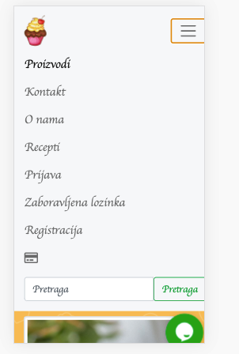

U gorenjem levom uglu se nalazi logo firme. Logo je prisutan na svim stranicama. 

Raspored menija:

* `Proizvodi`                      - Link koji otvara stranicu sa svim proizvodima
* `Kontakt`                        - Kontakt forma
* `O nama`                         - Radno vreme, kontakt iformacije i mapa sa tačnom lokacijom
* `Recepti`                        - Stranica sa receptima
* `Prijava`                        - Prijava korisnika, uneti korisničko ime i lozinku
* `Zaboravljena lozinka`           - Ukoliko je korisnik zaboravio lozinku, može zatražiti novu na linku
* `Ažuriranje profila`             - Pojavljuje se samo ako je korisnik ulogovan
* `Odjava`                         - Pojavljuje se samo ako je korisnik ulogovan
* `Registracija`                   - Registracija novog korisnika
* `Kartica`                        - Spisak svih proizvoda koje je korisnik dodao za plaćanje
* `Pretraga`                       - Detaljna pretraga proizvoda
* `Korisnička podrška - LiveChat`  - U donjem desnom uglu se nalazi dugme za Korisničku podršku

## Detaljan pregled menija

### Proizvodi

Stranica sa svim proizvodima. Korišćen je pristup gde se proizvodi izlistavaju po 3 na jednoj strani ako je desktop kompjuter, na mobilnom telefonu bi stranica ovako izgledala:

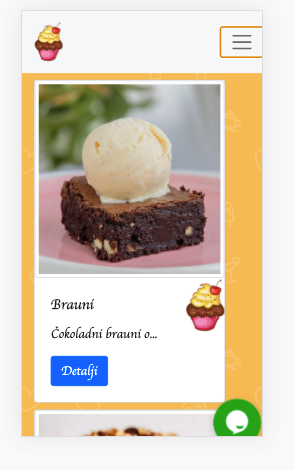

Boldovanim slovima je napisan naziv proizvoda, sa desne strane se nalazi logo firme, kratak opis proizvoda i link Detalji koji vodi do detaljnog pregleda proizvoda. Detaljan pregled proizvoda sadrži naziv proizvoda, kompletan i detaljan opis proizvoda, cenu  kao i link dodaj u korpu sa kojim se željeni proizvod dodaje u korpu. 
Ispod se nalazi slika proizvoda:

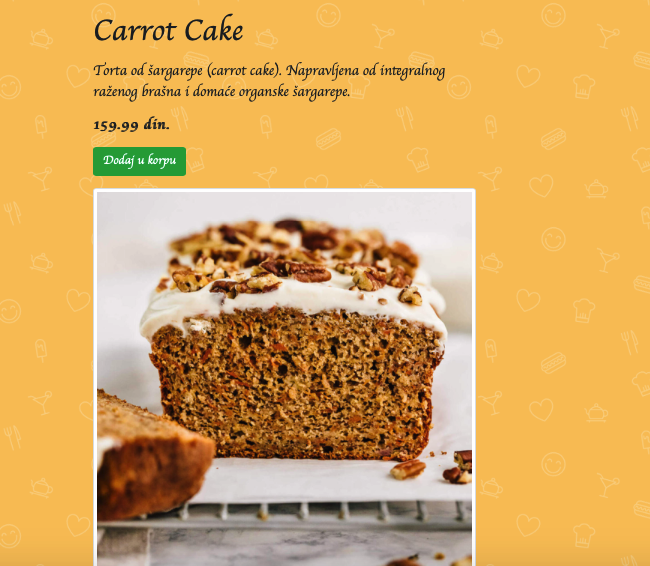

### Kontakt

Kontakt stranica služi kako bi korisnik poslao poruku. Nakon poslate poruke nama stiže email sa porukom i imenom korisnika. 
Sva polja u formi su obavezna, a polja koja treba uneti su Ime, Email i Poruka. Nakon poslate poruke korisniku se ispisuje na ekranu tekst "Poruka je uspešno poslata. Hvala Vam.", ili ukoliko se desila greška onda se korisniku prikazuje poruka "Dogodila se greška, molimo Vas pokušajte ponovo."

### O nama
Stranica o nama pokazuje sa leve strane radno vreme firme, broj telefona, email adresu kao i lonkove do oficijalnih Facebook, Instagram i Twitter profila - 

Sa desne strane se nalazi mapa, korišćena je Google mapa koja pokazuje detaljnu lokaziju kompanije. 

### Recepti

Stranica sa receptima. Ova stranica je zamišljena da bude u vidu blog-a, gde bi korisnici postovali svoje recepte. Ukoliko korisnik nije ulogovan, onda se pojavljuje obaveštenje korisniku da se mora ulogovati kako bi pristupio stranici sa receptima 

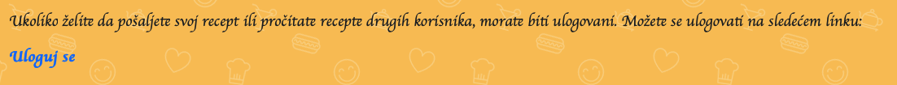

Ukoliko je korisnik ulogovan, pokazuje se stranica sa receptima i poseban search box uz pomoć kojeg korisnici mogu da pretražuju recepte

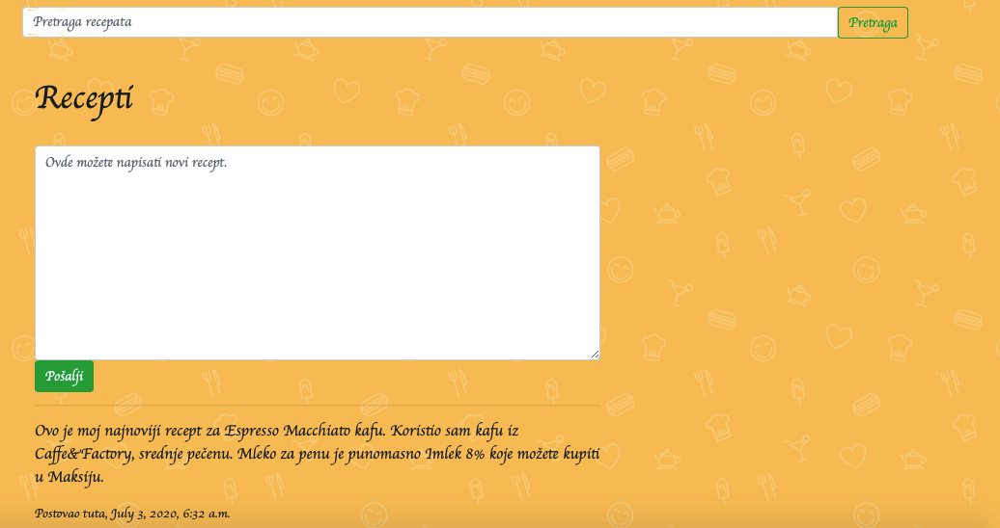

U polju pretraga korisnik kuca bilo koju ključnu reč koju sadrži recept i opcija search će izbaciti rezultate ako ih ima. Pretraga se automatski pokreće nakon jedne sekunde, nije neophodno da se klikne na dugme "pretraga".

Ispod pretrage, korisnik ima opciju da doda novi recept koji se automatski pojavljuje na vrhu strane. Recepti su sortirani od najskorijeg do najstarijeg. Takođe, ispod recepta se ispisuje korisničko ime korisnika koji je postovao recept kao i tačno vreme kada je recept postovan. 

### Prijava

Prijava služi kako bi ste se prijavili. Nakon uspešne registracije potrebno je prijaviti se koristeći korisničko ime i lozinku. 

### Zaboravljena lozinka
Ovaj link je dinamički, tj. ukoliko je korisnik ulogovan onda će ovaj link otvoriti stranicu za zamenu postojeće lozinke:

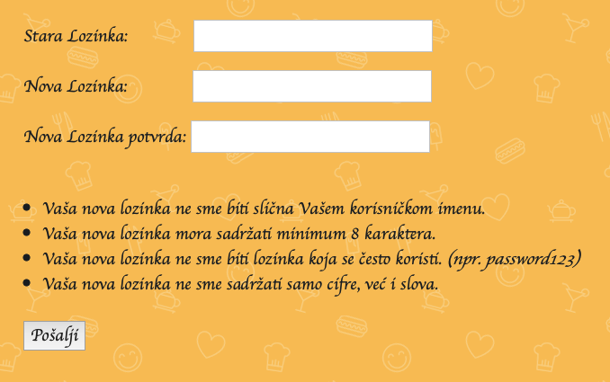

dok ako korisnik nije ulogovan otvara mu se stranica za resetovanje lozinke:

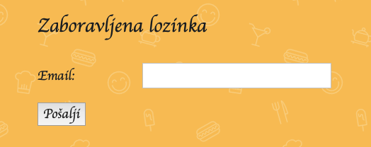.

Zamena postojeće lozinke se radi tako što u prvo polje korisnik unese strau lozinku, a u donja dva polja unese novu, a da pritom nova lozinka mora ispuniti sve uslove navedene na stranici za zamenu lozinke. 
Ukoliko korisnik traži reset lozinke, nakon što unese email otvoriće mu se stranica sa obaveštenjem da je link za promenu lozinke poslat na email:

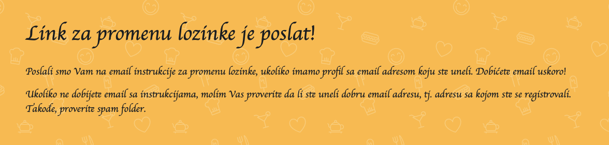

Link se može koristiti samo jednom i nakon sto korisnik klikne na link iz svog email-a:

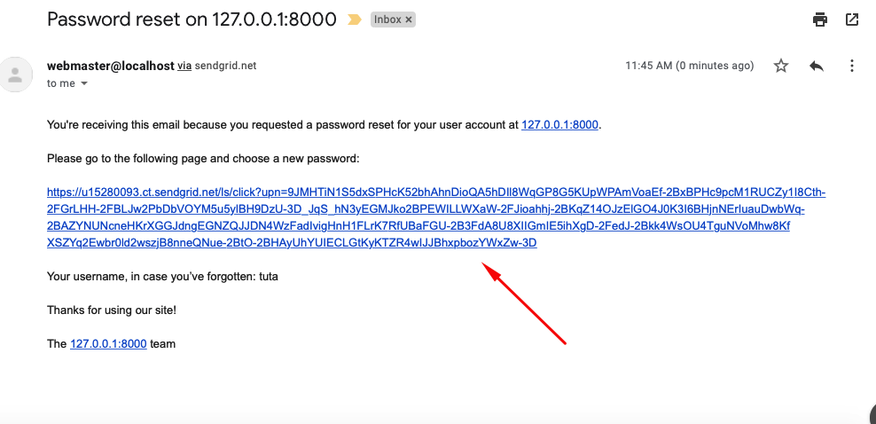

Otvara mu se stranica za zamenu lozinke:

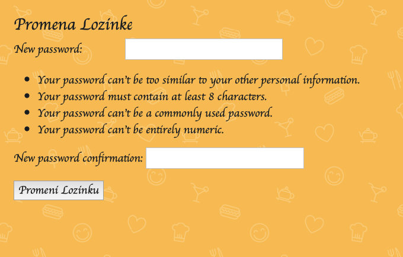. 

Nakon što promeni lozinku korisnik se mora ulogovati sa novim podacima:

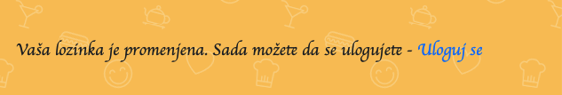

### Ažuriranje profila
Deo ažuriranje profila se pojavljuje samo ako je korisnik ulogovan. Ukoliko korisnik nije ulogovan onda se ova sekcija neće pojaviti. Klikom na link za ažuriranje profila, korisnik može zameniti email adresu, korisničko ime kao i lozinku. Ovaj deo se lako može proširiti tako da se korisniku takođe ponudi da u ovom delu unese il izameni svoju adresu, broj telefona ili čak i profilnu sliku.

### Registracija
Registracija služi za registrovanje novih korisnika. Sva polja su obavezna i potrebno je uneti Email adsresu, korisničko ime, lozinku kao i potvrda lozinke. Ukoliko nije uneta ista lozinka u oba polja izbacuje se poruka korisniku da uneta lozinka nije ista i da proba ponovo. Nakon uspešne registracije korisnik je automatski ulogovan. 

### Odjava
Deo odjava služi kako bi se odjavio korisnik. Ovaj deo se ne vidi ukoliko korisnik nije prijavljen. Nakon odjave korisniku se pokazuje poruka, hvala vam na korišćenju sajta, doviđenja. 

### Kartica
Nakon što korisnik klikne dodaj na karticu, proizvod će biti dodat na karticu. Sa leve strane se pokazuje redni broj proizvoda, link do proizvoda koji otvara detalje za taj proizvod kao link ukloni uz pomoć kojeg se proizvod izbacuje iz kartice. Sa desne strane je količina i cena. Što se tiče cene, ona se automatski prikazuje u zavisnosti od broja proizvoda koji su dodati na karticu. Prikazuje se ukupna cena proizovda, poštarina koja je u našem slučaju stavljena da bude 250 dinara kao i ukupna cena (sa poštarinom). Na dnu stranice je dugme plati koje vodi na stranicu za plaćanje:

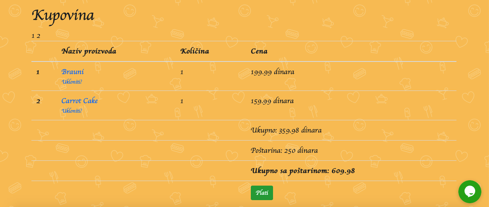

Stranica plaćanje pokazuje ukupnu cenu kao i lonkove za podržavane opcije plaćanja. Mi smo stavili VISA, PayPal i pouzeće ali tu listu je lako proširiti i dodati nove opcije plaćanja. Trenutno je aktivan samo link za plaćanje pouzećem:

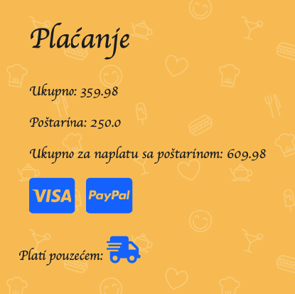

Ako je korisnik kliknuo na link plati pouzećem, otvara se stranica gde je potrebno popuniti sve informacije, ime, ulica, grad, telefon i email adresu i nakon sto korisnik klikne na dugme pošalji pojavljuje mu se poruka "Porudžbina je uspešno poslata. Kontaktiraćemo Vas u najkraćem roku. Hvala Vam.". Nakon toga se kartica prazni, tj. proizvodi koje je korisnik dodao na karticu se brišu sa iste. 
Sa naše strane dobijamo email sa id brojem porudžbine uz pomoć kojeg možemo videti koje je proizvode korisnik kupio, kada i koliko je platio. Mi mu šaljemo robu i sa Admin stranice menjamo status porudžbine iz kreirana u poslata (ovaj deo je opcioni i nije obavezan). 

### Pretraga
Pretraga traži proizvode u bazi po imenu, ceni, deskripciji ali takođe i po tagovima. To znači da ako mi imamo naziv proizvoda na primer "Carrot cake" a korisnik ukuca "karot" ili korisnik ukuca "kuki" umesto cookie pokazace mu se proizvodi koje je tražio. Primeri:

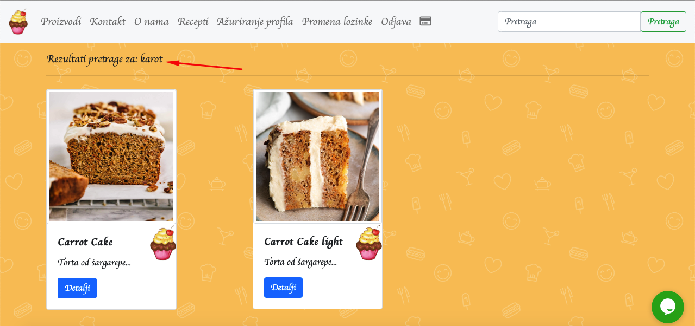  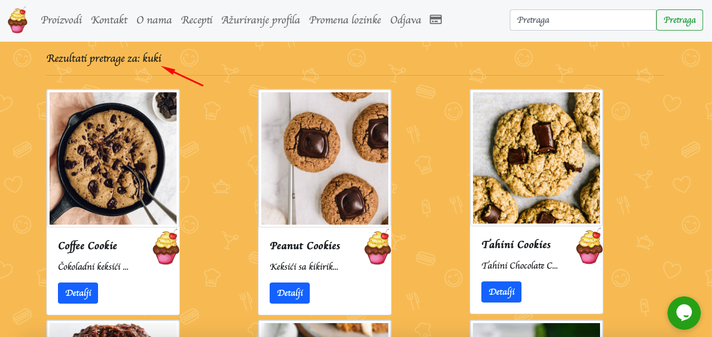

Ovo je jako korisna opcija jer korisnici često greše pri kucanju što dovodi do toga da na kraju odustanu od kupovine, tako da se uz pomoć tagova povećava user expirience. Ove tagove je moguće veokma lako proširiti sa Admin stranice i dodati bilo kakvu vezu, tako da je moguce recimo napraviti vezu koja izbacuje samo čokoladne torte ako ukucamo reč Nebojša:

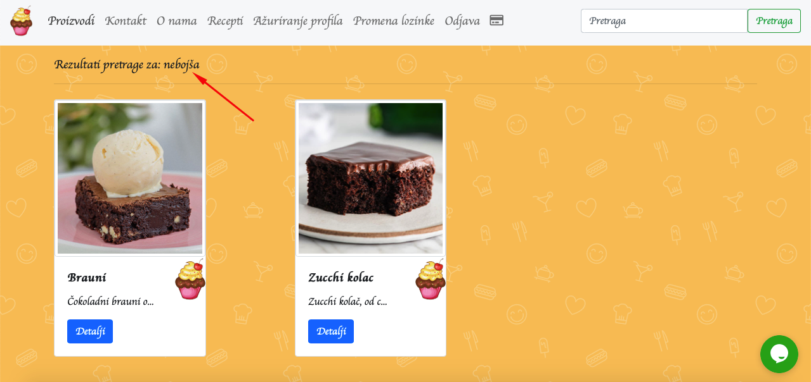 

Pretraga je takodje asinhrona, tj. nije potrebno kliknuti na search dugme, već nakon 1.5 sekundi kucanja u polju za pretragu (ovo vreme je moguće promeniti) opcija search se automatski pokreće uz lep "pretraga.." opis: 

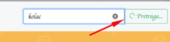. 
 
### LiveChat korisnička podrška

Koristili smo eksternu aplikaciju tawk.to koja je besplatna. Ukoliko korisnička podrška nije online, onda se otvara kontakt forma gde je potrebno upisati ime, email i tekst poruke:

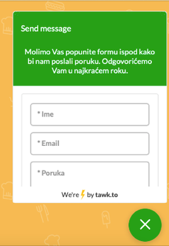 

Nakon što korisnik to pošalje, nama će stići email sa porukom koju je korisnik poslao. 
Ukoliko je korisnička podrška online, onda prozor izgleda drugačije:

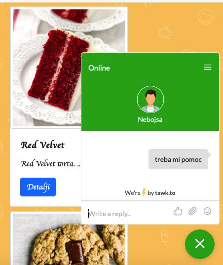

Korisnik piše sa njegove strane, dok mu vi odgovarate sa Admin strane.
